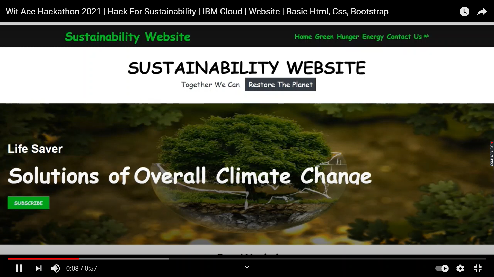
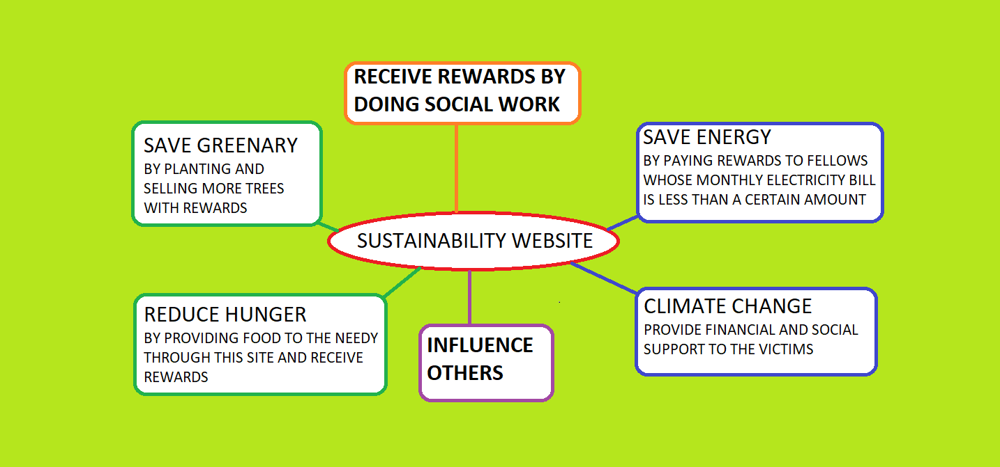

# Sustainability Website

  

A basic GitHub repository for ou Sustainability Website [Call for Code](https://developer.ibm.com/callforcode/) project.It addresses the overall climate change in different spheres of life.

### What's the problem?

Hack For Sustainability!
The Sustainable Development Goals developed by the United Nations(https://www.un.org/sustainabledevelopment/sustainable-development-goals/) are the blueprint to achieve a
better and more sustainable future for all. They address the global challenges we face, including poverty,inequality, climate change, environmental degradation, peace and justice. Approximately 9% of the global population is suffering from hunger. And, much of the world's food is grown by small-scale, independent farms and distributed through local community cooperatives who sell the surplus produce. The co-ops are a central point for quality control, deliveries, and enabling food commodity markets. However, these co-ops face a myriad of logistical challenges to get the right food to the right places with minimal time and cost. In this era still lots of people are victims to poverty, hunger and climate change. Climate change is a by product of deforestation and loss of green. Over the top there is limitless watsage of power and energy nowadays. 

### How can technology help?

Schools and teachers can continue to engage with their students through virtual classrooms to do more social work and show to the world what each one of them can do. As parents face a new situation where they may need to homeschool their children, finding appropriate online resources is important as well. This website will guid them all sections of the society and reward them for each work they do.Technology can help in many ways, from recommendations on energy efficiency to highlighting the carbon footprint of online purchases.From intelligent solutions for small farmers to recycling showers, technology can make a significant impact on the availability of water and its consumption. IBM provides various technologies such as IoT, Watson,and blockchain. 
Technology can help in many ways. For example, by bringing the paper ledgers of food co-ops online, communities can harness data insights from their environment for better crop resilience and overall yield for sustainable food production systems. More crops mean better access to food for the community. Rural farmers might not have access to network connectivity, digital literacy, or the language to adopt tech solutions directly, so the co-ops become the pivotal point of innovation

### The idea

The idea is to give rewards for each social work a person does with prove. In this way we can spread positivity and come up with a solution to uplift some sections of the society.

## Demo video

[![Watch the video]](https://youtu.be/-8RxCrG6UfM)

## Long description

[More detail is available here](./docs/DESCRIPTION.md)

## Project roadmap

The project does and aims the following things!!!
It's in a simple website prototype addressing the basic needs of humanity. In the future we plan to run on Red Hat OpenShift, for example.

## Getting started

We have the html code in public->index.html file.
Then the css code in the style.css file and images in the images folder.
You can copy paste the code and run it on any online/offline ide.

## Live demo

You can find a running system to test at https://simple-website-sustainability.eu-gb.mybluemix.net

## Built with

- [IBM Cloud Foundry](https://cloud.ibm.com/cloudfoundry/overview) - Deploy and run your applications without managing servers or clusters with IBM Cloud Foundry
- [IBM Cloud Functions](https://cloud.ibm.com/catalog?search=cloud%20functions#search_results) - The compute platform for handing logic
- [IBM API Connect](https://cloud.ibm.com/catalog?search=api%20connect#search_results) - The web framework used

## Contributing

Please read [CONTRIBUTING.md](CONTRIBUTING.md) for details on our code of conduct, and the process for submitting pull requests to us.

## Website Link

Website Link: https://simple-website-sustainability.eu-gb.mybluemix.net/

## Authors

- *Rijushree Guha** - _Initial work_ - [Rijushree Guha](https://github.com/Rijushree123)

## License

This project is licensed under the Apache 2 License - see the [LICENSE](LICENSE) file for details.

## Acknowledgments

- Based on [Billie Thompson's README template](https://gist.github.com/PurpleBooth/109311bb0361f32d87a2).
